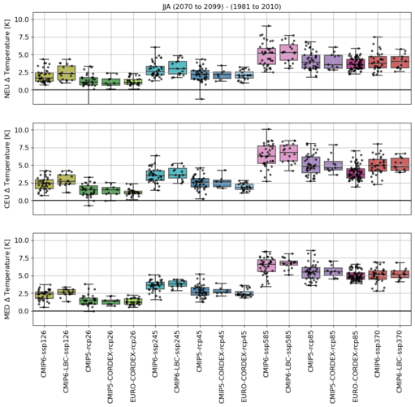
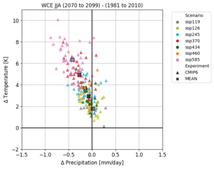
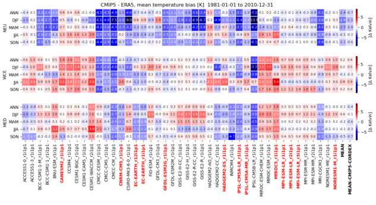

# This work was done in PRINCIPLES (Copernicus, 3CS)

Pictures:

[ECMWF Webpage](https://confluence.ecmwf.int/display/CKB/Evaluation+of+CDS+climate+projections)
[Report](https://confluence.ecmwf.int/display/CKB/Evaluation+of+CDS+climate+projections?preview=/181113935/235631633/C3S_D34b_Lot2.3.4.2_CS4_GCMsDownscaledEUROCORDEX_RCMs_merged_v3corrected.pdf)

# Data processing of CMIP5 CMIP6 and EURO-CORDEX

This is a collection of programs used to compare 
CMIP5, CMIP6 and EURO-CORDEX data.

The program PySpaTeM calculated the area mean for landpoints only, for the following reagions: 

 * Germany
 * SRES regions: NEU, WCE, MED
 * PRUDENCE regions

For the time slices:

 * 1981-2010
 * 2036-2065
 * 2070-2099

These results are store in large DataFrames in the following directories:

      INPUT_DATA 
      INPUT_DATA_EOBS 
      INPUT_DATA_ERA5
      
In table are the used CMIP5 (table/CMIP5_Liste_historical_rcp_tas_pr.pdf) and CMIP6 (file:table/CMIP6_Liste_historical_ssp_tas_pr_LBC.pdf) data stored.

In the following python scripts the data just sorted into smaller dataframes and later plotted.
This directory contains all scripts needed for the task:
  
#### py_plotting_cmip_cordex
All programs are stored in:

    py_plotting_cmip_cordex
    
A collection of functions are stored in:

    - dp_cmip_plotting_tools.py
    - dp_cmip_tools.py

### read large dataframe and save in small dataframe
   
    1.) python Create_df_for_plots.py
    2.) python Create_df_for_plots_eobs.py
    3.) python Create_df_for_plots_era5.py
    4.) python Create_df_for_heatmaps.py

The programs run with out editing and create files in:
 
    1.) ../SCATTERPLOTS/data/*.csv 
    2.) ../HEATMAP/data/ERA5/*.csv
    3.) ../HEATMAP/data/EOBS/*.csv
    4.) ../HEATMAP/data/CMIP5(6)/*.csv

Observations and ERA5 input dataframes are a little different to dataframes of models, therefore they got their own script
   

### plot-script for stripplot
Stripplots for temperatur or precipitation change averaged
over the SRES regions 

NEU CEU MED 

for landpoints only historical and different sceanrios

ssp126, ssp245, ssp585, ssp370, rcp26, rcp45, rcp85.

This plot compares different ensembles:

    * CMIP6
    * CMIP6 which offer boundary data for dynamical downscaling
    * CMIP5
    * CMIP5 used as forcing for EURO-CORDEX
    * EURO-CORDEX

This program runs almost on its own, a selection of the variable tas or pr is required before starting, the program reads 

    SCATTERPLOTS/data/*.csv
files and the results are stored in 

    ../STRIPPLOTS/plots/*.png

     
### plot-script for SCATTERPLOTS
This plot compares different ensembles:

    * CMIP6
    * CMIP6 which offer boundary data for dynamical downscaling
    * CMIP5
    * CMIP5 used as forcing for EURO-CORDEX

This program plots all scenarios for CMIP5 or CMIP6:

    cmip5_cmip6_scatter_plot_all_scenarios.py

This program plots CMIP5 and CMIP6 for the correponding scenarios or you can plot EURO-CORDEX with the korresponding GCMS from CMIP5, can be selected at the beginning:  
  
    cmip5_cmip6_cordex_scatter_plot.py

### plot-script for HEATMAPS
Heatmaps for climate change are ploted for monthly or seasonal values averaged over 30 years. 

    cmip5_cmip6_heatmap_mon_plot.py
    cmip5_cmip6_heatmap_seas_plot.py

Heatmaps showing the bias to ERA5 data for the historical timeperiod (models used as forcing for EURO-CORDEX are highlghted in red):

    cmip5_cmip6_era5_heatmap_season_1x3_plot.py

